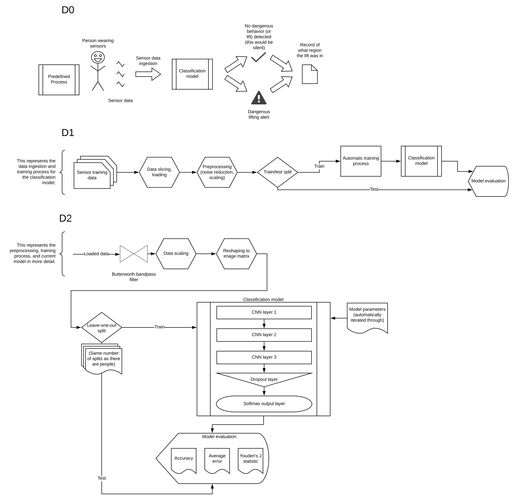

# Design Diagrams

## Predicting Back Injury Risk for Workers

Overall goal: a high-accuracy model that can recognize high, medium, and
low-risk lifting of objects.

## Explanation

### D0

D0 is primarily focused on the way the model would be used in applications. As
described in the project description, the person wearing the clusters of
accelerometer and gyroscope sensors would have their data (in a slice of time
around 5 seconds) sent to the model. The model would then say that the lift was
either safe or unsafe, additionally labelling it with a lifting zone (again,
described in the project description). Regardless of the result, the region the
lift was in would also be recorded.

### D1

D1 elaborates further on how the model itself would be developed, rather than
the end result.

First, the training data would be sliced to the correct time window and
accumulated into the correct data structure. To prepare the data for training,
some preprocessing is also necessary (removing noise, scaling the data so the
training model will accept it). Finally, as is typical, the training data would
be split into a training set and a testing set before being applied to the
untrained model.

Automatically, the model will train itself on the training set and seek to
converge on a model that it thinks classifies the data, outputting itself once it has
completed the training process. Once this is complete, the model will be
evaluated to determine how well it classified the data.

Not shown here is the cycle of tweaking parameters, updating preprocessing, and
other changes to the individual steps that inform future changes.

### D2

D2, the most detailed, displays the current structure of the data pipeline and
training method as of September 23, 2019 (subject to change).

Data slicing and loading is not shown - the first line is the current
preprocessing, consisting of three steps: a Butterworth bandpass filter, scaler,
and reshaper. The bandpass filter exists to both reduce underlying noise from
the sensor data, which is treated here much like a sound wave, but also to
center the entire dataset at zero. Scaling, meanwhile, globally scales each
sensor type (such as left arm accelerometer) in the range [-1, 1], to enable
faster and more accurate training. Finally, reshaping to an image matrix creates
a 3D array of length 14, width 150, and depth 3, resulting in what is
essentially an RGB image encoded in floating point instead of [0, 255].

The second half of the diagram is the model setup. Basic train/test splitting is
replaced with leave-one-out splitting, which takes one of the test subjects in
the data, uses them for testing, and has the other subjects train the model. The
parameters are also shown on the right, which are separate from the rest of the
process and injected manually.

A convolutional neural network (CNN) is currently utilized for training,
consisting of three convolutional layers. Data is fed through each layer and
then through a dropout layer, which removes a fraction of the results each time
to prevent overfitting to the dataset. Finally, a softmax output layer provides
the probablility that each zone (1-12) or each risk level (1-3) is the correct
label for the result. Not shown here is the training method of backpropagation
that the model goes through when converging.

Evaluation currently consists of testing the model against the test subject and
retrieving an overall accuracy for the labels, average error for the risk labels
(1-3), as it is a linear scale, and, finally, Youden's J statistic, which seeks
to estimate how likely it is that the results are better than simple random
selection of the classes for each test trial.
